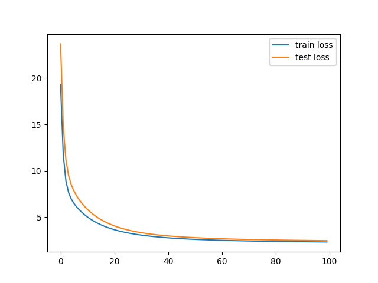
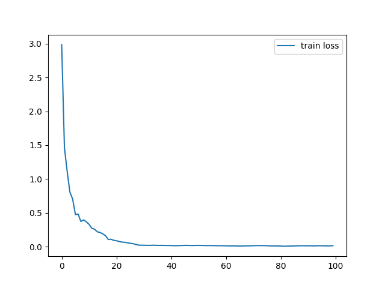
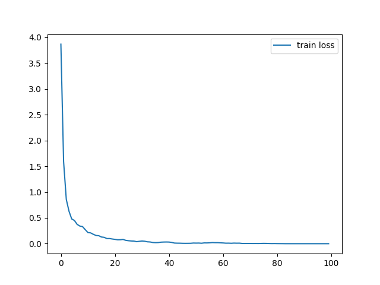

# gradient-descent

梯度下降模型实验（对《[An overview of gradient descent optimization algorithms](https://arxiv.org/abs/1609.04747)》内容的复现）

数据集：`sklearn.datasets`中的波士顿数据集。

## 梯度下降的三种变体

BGD（批梯度下降）、SGD（随机梯度下降）和Mini-batchGD（小批梯度下降）。

### BGD

在`BGD.py`中，按7:3划分训练集和测试集，以0.0001的学习率对训练集进行100轮迭代，并绘制训练误差-轮次和测试误差-轮次曲线：

### SGD

在`SGD.py`中，按7:3划分训练集和测试集，以0.001的学习率对训练集进行100轮迭代，并绘制训练误差-轮次曲线：

### mini-batch GD

在`mini-batchGD.py`中，按7:3划分训练集和测试集，将数据以64条为单位进行划分，以0.001的学习率对训练集进行100轮迭代，并绘制训练误差-轮次曲线：

