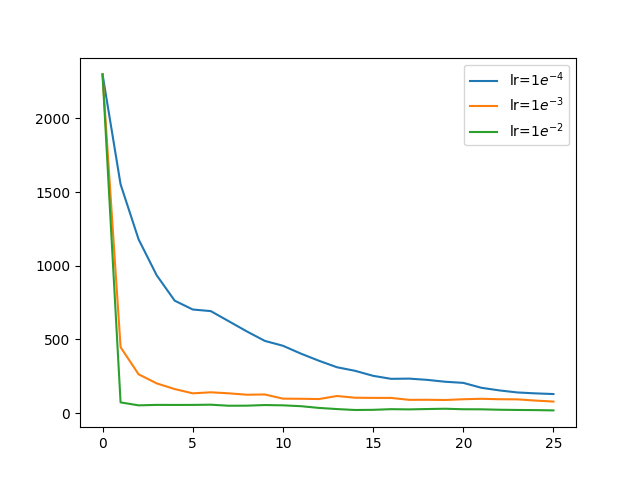
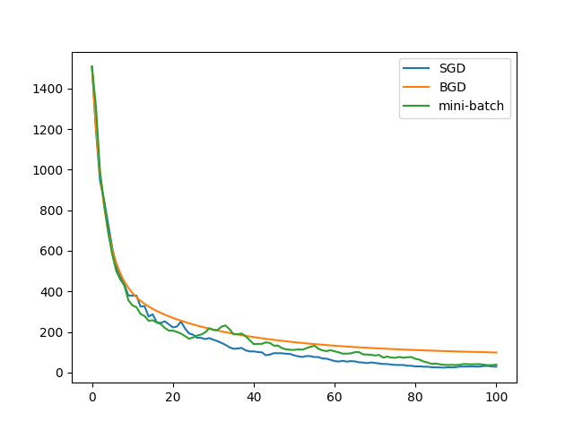
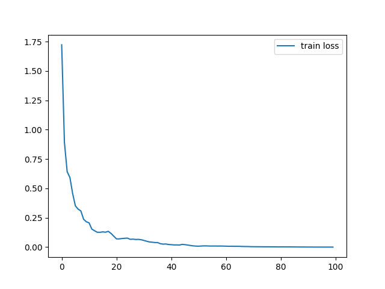
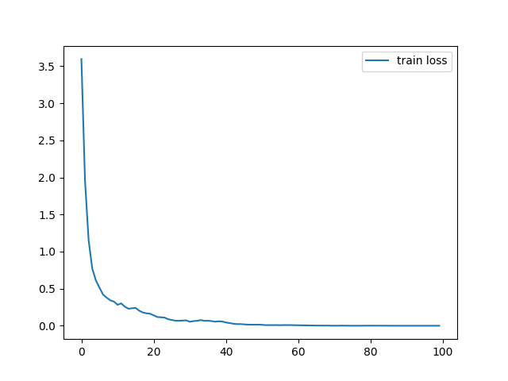
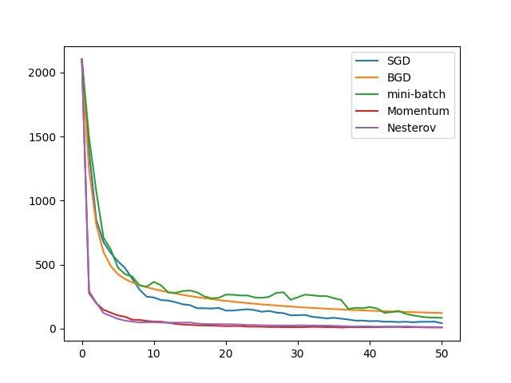
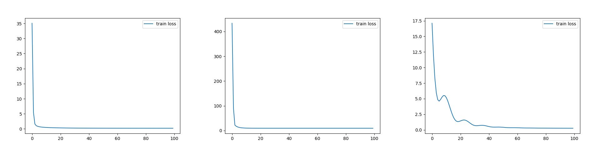
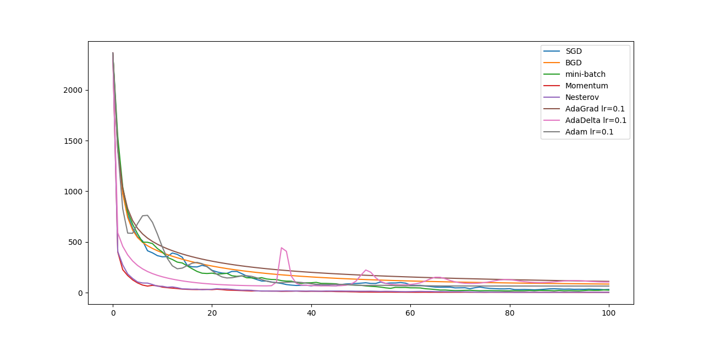

# gradient-descent

梯度下降模型实验（对《[An overview of gradient descent optimization algorithms](https://arxiv.org/abs/1609.04747)》内容的复现）

数据集：`sklearn.datasets`中的波士顿数据集。

## 梯度下降的三种变体

BGD（批梯度下降）、SGD（随机梯度下降）和Mini-batchGD（小批梯度下降）。

SGD算法，不同学习率下的下降效果：

控制相同的学习率5e-5，对于相同的参数初始点和数据进行三种梯度下降：

## 梯度下降优化算法

### 动量机制

### Nesterov

### 动量机制的加入对梯度下降的影响

控制学习率相同（1e-4）：

### Adagrad, Adadelta和Adam

## 总览

